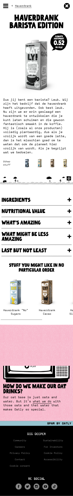
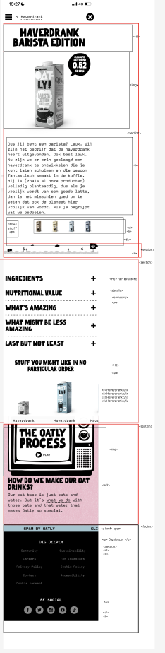
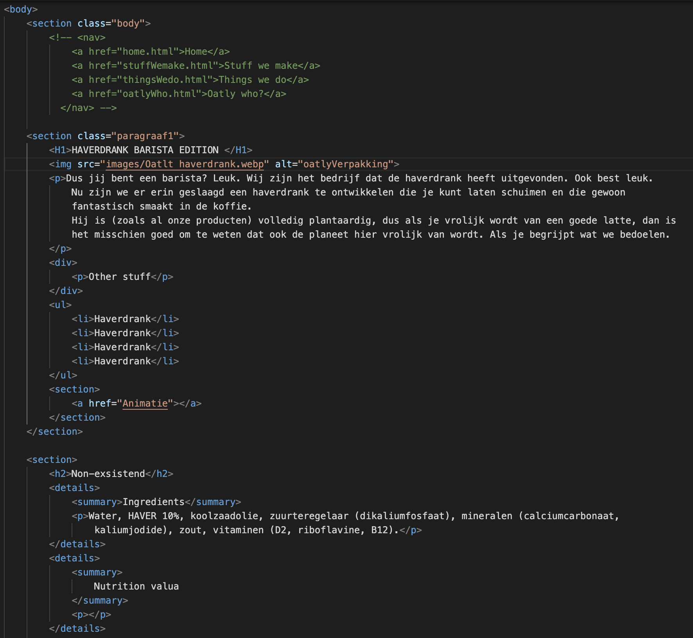

# Procesverslag
Markdown is een simpele manier om HTML te schrijven.  
Markdown cheat cheet: [Hulp bij het schrijven van Markdown](https://github.com/adam-p/markdown-here/wiki/Markdown-Cheatsheet).

Nb. De standaardstructuur en de spartaanse opmaak van de README.md zijn helemaal prima. Het gaat om de inhoud van je procesverslag. Besteedt de tijd voor pracht en praal aan je website.

Nb. Door *open* toe te voegen aan een *details* element kun je deze standaard open zetten. Fijn om dat steeds voor de relevante stuk(ken) te doen.

## Jij

  
uitwerken voor kick-off werkgroep

  ### Auteur:
  Jaden straal.

  #### Je startniveau:
  Piste: Blauw.

  #### Je focus:
  Extra aandacht aan responsive op mobile formaat. In de huidige website past het net niet op mobile formaat.

## Je website

  
uitwerken voor kick-off werkgroep

  ### Je opdracht:
  link naar de website die je gaat namaken óf de naam/omschrijving van je eigen ontwerp
www.oatly.nl
  #### Screenshot(s) van de eerste pagina (small screen): 
  hier de naam van de pagina: Home

  
  
  
  #### Screenshot(s) van de tweede pagina (small screen):
  hier de naam van de pagina  Haverdrank barista edition
  
 

## Toegankelijkheidstest 1/2 (week 1)

  
uitwerken na test in 2e werkgroep

  ### Bevindingen
  Lijst met je bevindingen die in de test naar voren kwamen:
  Er is een skip to knop dit geeft feedforward aan de gebruiker. 
  De pagina heeft heel veel plaatjes en links naar verschillende pagina's dit is beetje verwarrend voor gebruikers die voor het eerst op de pagina komen. Het hamburger menu helpt voor de toegankelijkheid om de gebruiker op weg te helpen.

## Breakdownschets (week 1)

  
uitwerken na afloop 3e werkgroep

  ### de hele pagina: 
  

  ### dynamisch deel (bijv menu): 
  

  ### wellicht nog een dynamisch deel (bijv filter): 
  

## Voortgang 1 (week 2)

  
uitwerken voor 1e voortgang

  ### Stand van zaken
Dus de stand van zaken. Eerst heb ik de lettertypes toegevoegd, dit ging goed en lukte direct. Vervolgens heb ik de afbeeldingen van pagina 2 (Haverdrank barista edition) gedownload en in de images map gezet. 
het was lastig om het pak melk en het berichtwolk naast elkaar te zetten. Aangezien dit niet lukte ben ik verder gegaan met de summary tag toetevoegen.

  ### Agenda voor meeting
  samen met je groepje opstellen

Html van david, want hij had elementen in zijn website die derest ook nodig heeft.
Alle vragen gaan over Css. 
Het stylen van de Nav en summary tag.
Ook teksten over afbeeldingen in het algemeen, hoe dat werkt.
  ### Verslag van meeting
  hier na afloop snel de uitkomsten van de meeting vastleggen

  - Geen classes gebruiken maar pseudo-elementen
  - Deze website staat in hoe je bijv een H2 invisble maakt en hoe je scroll snap gebruikt.
  https://www.a11yproject.com/posts/how-to-hide-content/  
  - Ik weet nu hoe je een summary tag styled in css
  
  

## Voortgang 2 (week 3)

  
uitwerken voor 2e voortgang

  ### Stand van zaken
  Minimaal 3 css bestanden. Dit heb ik direct aangepast. Hierdoor was mijn website niet in de juiste font. Ik was vergeten mijn algemeen.css te verbinden met Html pagina. Ook heb ik een footer gemaakt en gestyled. 

  ### Agenda voor meeting
  samen met je groepje opstellen

  | student 1      | student 2          | student 3   
  kan je een gradient overlay boven een image plaatsen? | student 4     
  carroussel graag bespreken hoeje dat moet maken.   |
  | nav laten animeren.   hoe kan ik ervoor zorgen eindloos doorscrollen?

  gemakkelijk carroussel      | ...                | ...          | ...              |

  ### Verslag van meeting
  hier na afloop snel de uitkomsten van de meeting vastleggen
We hebben in deze meeting veel antwoorden gekregen op onze vragen. 
Vooral kleine details die ik over het hoofd zag.

## Toegankelijkheidstest 2/2 (week 4)

  
uitwerken na test in 9e werkgroep

  ### Bevindingen
  Lijst met je bevindingen die in de test naar voren kwamen (geef ook aan wat er verbeterd is):

## Voortgang 3 (week 4)

  
uitwerken voor 3e voortgang

  ### Stand van zaken
  hier dit ging goed & dit was lastig (neem ook screenshots op van delen van je website en code)

  ### Agenda voor meeting
  samen met je groepje opstellen

  | student 1      | student 2          | student 3    | student 4        |
  | ---            | ---                | ---          | ---              |
  | dit bespreken  | en dit             | en ik dit    | en dan ik dat    |
  | en dat ook nog | dit als er tijd is | nog een punt | dit wil ik zeker |
  | ...            | ...                | ...          | ...              |

  ### Verslag van meeting
  hier na afloop snel de uitkomsten van de meeting vastleggen

  - punt 1
  - punt 2
  - nog een punt
  - ...

## Eindgesprek (week 5)

  
uitwerken voor eindgesprek

  ### Dit ging goed/Heb ik geleerd: 
 Ik ben verbaasd over wat ik allemaal zelf heb kunnen coderen zonder hulp. Ik begin het steeds beter te begrijpen
 

  ### Je uitkomst - karakteristiek screenshots:

  ### Dit was lastig/Is niet gelukt:
 Alles ging fout toen ik aan mn tweede pagina begon. Ik had niet gecontroleerd hoe mijn eerste pagina hierop zou reageren. Maar al mn CSS stond door elkaar heen. Ik vond het super lastig om dit weer goed te nesten. 

## Bronnenlijst

  
continu bijhouden terwijl je werkt

  Nb. Wees specifiek ('css-tricks' als bron is bijv. niet specifiek genoeg). 
  Nb. ChatGpT en andere AI horen er ook bij.
  Nb. Vermeld de bronnen ook in je code.
1. https://cssgridgarden.com/#nl
2. https://css-tricks.com/snippets/css/complete-guide-grid/
3. https://css-tricks.com/snippets/css/a-guide-to-flexbox/
4. https://www.oatly.com/nl-nl/stuff-we-make
5. https://www.oatly.com/nl-nl/stuff-we-make/haverdrank/haverdrank-barista-edition-1l
6. https://developer.mozilla.org/en-US/docs/Web/CSS/background-size
7. https://codepen.io/KaoriYes/pen/xxMrbVy
8. https://developer.mozilla.org/en-US/docs/Web/CSS/@media/width
9. https://codepen.io/shooft/pen/ZEVRmdG
10. https://www.w3schools.com/tags/tag_summary.asp#gsc.tab=0
11. https://www.w3schools.com/css/css_background_repeat.asp
12. https://www.w3schools.com/css/css_image_gallery.asp

